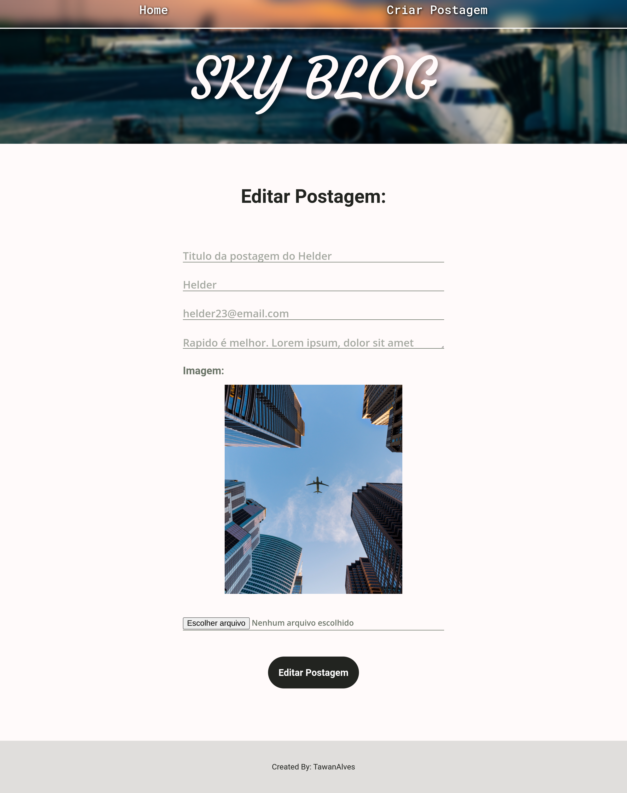
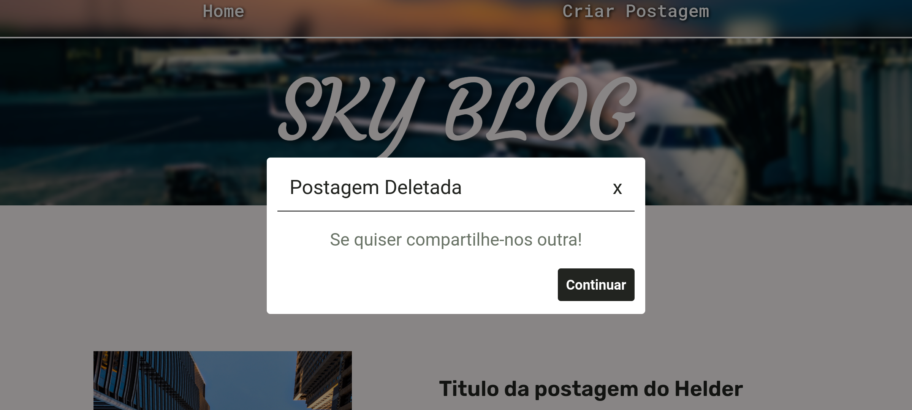
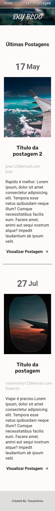
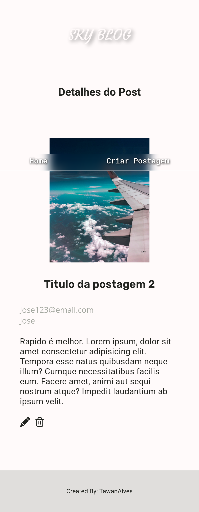
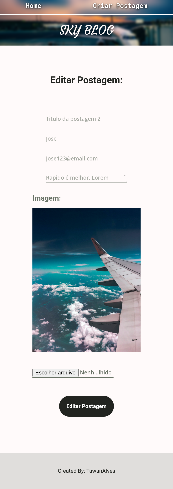
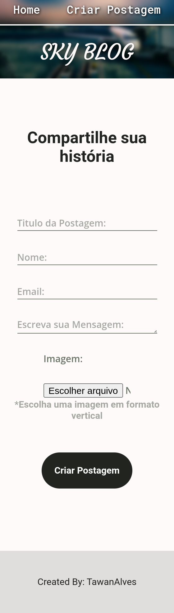

# skyblog

## Created using React,TypeScript and NodeJs

## Setup

Clone the repo and then run `npm install` at Client and Server

### `npm start`

Runs the Server
Open [http://localhost:3000](http://localhost:3000) to view it in your browser.

### `npm run dev`

Runs the Client
Open [http://localhost:5173/](http://localhost:5173/) to view it in your browser.

  
  

 
 

 

  

  
 

  

  
 
 

  
 
 

  
 
 

  
 
 

  
 
 

  
 
 

  
 

